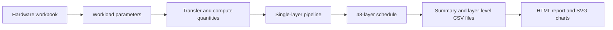

# Zhicun Technology Internship Project: HBF MFU Formula Simulator

This private repository contains an internship project completed for Zhicun Technology. It implements a formula-driven simulator for estimating Model FLOPs Utilization (MFU), HBF traffic and utilization, and end-to-end latency for the M12-24B model described in the project specification.

The implementation follows two principles:

- Model only the computation and data movement that can be derived explicitly from the source specification.
- Apply minimal corrections to dimensional or dependency inconsistencies without fitting outputs or introducing hidden assumptions.

## Project Scope

The simulator accepts hardware parameters and workload settings, expands the workload into transfer and compute quantities, constructs a single-layer pipeline schedule, and propagates it across 48 layers. It can export summary metrics, layer-level timing data, an HTML report, and SVG visualizations.

The current version supports baseline non-AFD prefill and decode scenarios. It is an analytical formula model, not a hardware-calibrated performance model.

## Repository Structure

```text
assets/presentation/       Figures used by technical presentations
config/                    Hardware input workbook
docs/internship/           Internship learning notes
docs/specification/        Original project specification
presentations/             Briefing decks and speaker scripts
src/                       Simulator and visualization source code
tests/                     Formula and report-generation tests
```

## Data Flow



## Inputs

Hardware metrics are read from `config/hardware-metrics-template.xlsx`, including chip count, matrix throughput and utilization, HBF bandwidth and latency, DDR bandwidth, and PCIe bandwidth and latency.

Each simulation also requires `mode`, `batch-size`, `input-seqlen`, and `history-seqlen`. `tail-kv-tokens` is required when the history length is greater than zero.

## Running the Simulator

Prefill example:

```powershell
python -m src.hbf_mfu_simulator `
  --hardware-file .\config\hardware-metrics-template.xlsx `
  --mode prefill `
  --batch-size 1 `
  --input-seqlen 1024 `
  --history-seqlen 0 `
  --csv .\simulation-summary.csv `
  --detail-csv .\layer-timing.csv `
  --visual-dir .\simulation-results
```

Decode example:

```powershell
python -m src.hbf_mfu_simulator `
  --hardware-file .\config\hardware-metrics-template.xlsx `
  --mode decode `
  --batch-size 1 `
  --input-seqlen 1 `
  --history-seqlen 1024 `
  --tail-kv-tokens 16 `
  --csv .\simulation-summary.csv `
  --detail-csv .\layer-timing.csv `
  --visual-dir .\simulation-results
```

## Outputs

- MFU (%)
- HBF read utilization (%)
- HBF write utilization (%)
- End-to-end latency (ms)
- Optional timing details for all 48 layers

When `--visual-dir` is provided, the simulator also generates an HTML overview and SVG charts for scenario comparison, first-layer pipeline timing, and cumulative 48-layer latency.

Existing CSV files can be visualized independently:

```powershell
python -m src.generate_visualizations `
  --summary-csv .\simulation-summary.csv `
  --detail-csv .\layer-timing.csv `
  --output-dir .\simulation-results
```

## Tests

```powershell
python -m unittest discover -s tests -v
```

## Current Limitations

- Only single-scenario, non-AFD prefill and decode flows are supported.
- AFD metrics are not produced because the source specification does not provide a complete timing model.
- `tail_kv_tokens` must be supplied explicitly for standalone decode scenarios.
- Top-k latency, vector and softmax operations, SRAM tiling, and communication-computation overlap are not yet modeled in detail.
- Results are analytical formula outputs and have not been calibrated against production hardware.

## Confidentiality

This is a private internship repository. Project specifications, hardware parameters, presentation materials, and derived results should not be redistributed without authorization.
