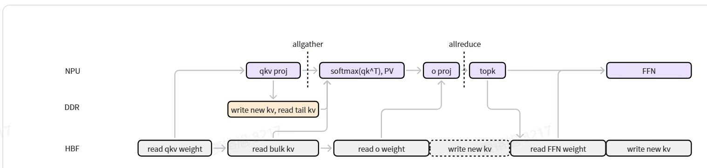
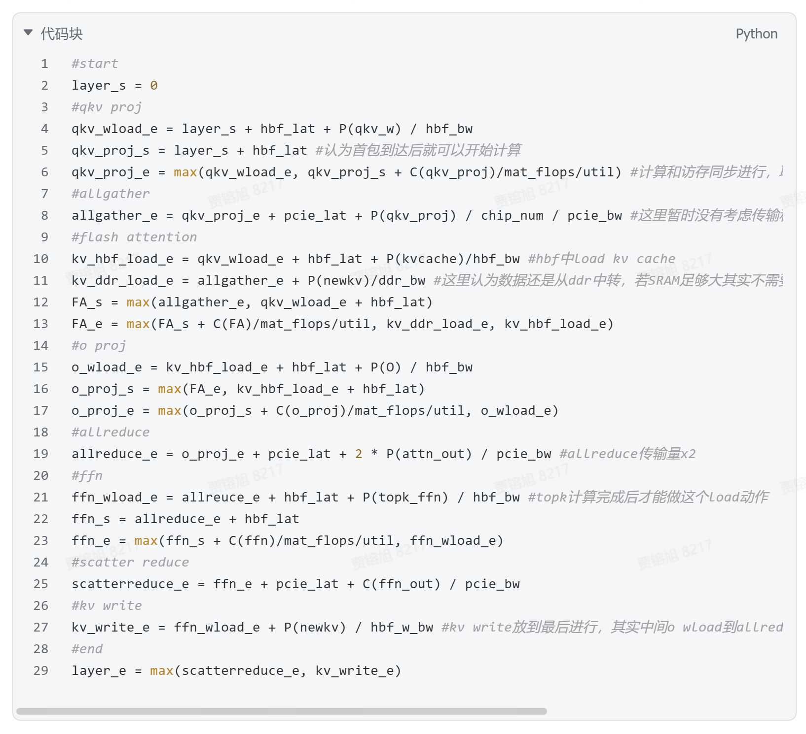

# HBF MFU五分钟技术汇报：逐页结构与讲稿

## 汇报口径

- **听众：**导师或技术负责人
- **目标时长：**4分40秒，预留20秒切页或停顿
- **核心主线：**读懂计算流 -> 发现公式问题 -> 实现基础仿真器
- **结果口径：**不展示任务书中的具体MFU、利用率和延迟数值，不声称已经复现原文结果
- **表达口径：**将问题区分为“确定错误”和“原文缺失的建模信息”，不把缺失信息包装成代码结论

## 时间分配

| 页码 | 主题 | 时间 |
|---|---|---:|
| 1 | 汇报目标 | 15秒 |
| 2 | 我从任务书中学到了什么 | 60秒 |
| 3 | 公式错误与建模缺口 | 95秒 |
| 4 | 我现在做了什么 | 80秒 |
| 5 | 当前成果边界 | 30秒 |
| **合计** |  | **4分40秒** |

---

## 第1页：从HBF MFU任务书到可执行仿真器

### 页面文字

**从HBF MFU任务书到可执行仿真器**

任务书理解 | 公式审查 | 基础实现

- 理解硬件架构与计算流
- 检查公式量纲与数据依赖
- 将明确部分实现为可验证程序

### 版式建议

- 标题置于左上方，副标题放在标题下方。
- 页面中部横向放置三个步骤：`理解 -> 审查 -> 实现`。
- 不放结果数字，也不在封面堆叠任务书背景。

### 逐页讲稿（15秒）

> 老师好，这次汇报三部分：我从HBF MFU任务书中学到了什么，发现了哪些公式错误和建模缺口，以及如何把明确内容实现为可运行、可验证的基础仿真器。

---

## 第2页：我从任务书中学到了什么

### 页面文字

**1. 存储分工**

- HBF：直接读取权重与bulk KV
- DDR：new KV与tail KV周转
- SRAM：承接片上计算与tiling

**2. 单层计算流**

`QKV投影 -> allgather -> Flash Attention -> O投影 -> allreduce -> FFN -> scatter-reduce -> KV write`

**3. 并行与指标**

- Attention采用TP，MoE可采用top-k并行
- `P(.)`表示数据量，`C(.)`表示计算操作量
- Prefill更偏计算受限，decode更偏带宽受限

### 图示

使用时只保留计算流图主体，突出NPU、DDR、HBF三条路径。不要把原截图下方的大段文字一起放到PPT中。

### 逐页讲稿（60秒）

> 我从任务书中主要学到三点。第一，HBF和DDR不是传统前后级：权重与bulk KV由NPU直接从HBF读取，DDR周转new KV和tail KV，SRAM承担片上计算。第二，单层依次经过QKV投影、allgather、Flash Attention、O投影、allreduce、FFN、scatter-reduce和KV写回，阶段结束时间取决于计算、访存和通信中最慢的一项。第三，Attention采用TP，MoE可用top-k并行减少all-to-all。P表示传输字节数，C表示计算操作数。任务书的定性判断是prefill更偏计算受限、decode更偏带宽受限，所以decode还要关注HBF利用率和端到端延迟。

---

## 第3页：公式错误与建模缺口

### 页面文字

#### 确定错误：可以直接修正

1. **量纲错误**：`C(ffn_out) / pcie_bw`应为`P(ffn_out) / pcie_bw`
2. **数据依赖缺失**：公式未体现new KV先写DDR，再与tail KV一起读取
3. **访问延迟缺失**：KV write公式未计入`hbf_lat`
4. **变量拼写错误**：早期版本的`allreuce_e`应为`allreduce_e`

#### 建模缺口：不能擅自补齐

- AFD只有“F时间匹配A时间”的假设，没有完整时序公式
- `tail_kv_tokens`没有定义
- 48层和250 us启动粒度没有在原公式中完整展开
- top-k、vector、softmax、SRAM tiling及通信计算重叠未详细建模

### 图示

建议在PPT中对截图添加四个标注：

- 第11行：标“new KV写入依赖与tail数据量缺失”
- 第21行：标“变量拼写错误”
- 第25行：标“C是操作数，不能除以带宽”
- 第27行：标“HBF访问延迟缺失”

### 逐页讲稿（95秒）

> 问题分为两类。第一类是确定错误。scatter-reduce写成C(ffn_out)除以PCIe带宽，但C是操作数、带宽是字节每秒，两者相除得不到时间；这里传输FFN输出，应使用P(ffn_out)。文字又要求new KV先写DDR，再与tail KV一起读取，而公式既没有写入完成依赖，也没有tail数据量。KV写HBF还漏了访问延迟，早期版本也有allreduce变量拼写不一致。第二类是原文缺失：AFD没有完整时序，tail KV长度未定义，250微秒没有说明如何进入总时长，top-k、vector、softmax、tiling和通信重叠也未建模。这些内容不能靠拟合或隐藏假设补上，因此原文结果不能直接当作精确仿真结果。

---

## 第4页：我现在做了什么

### 页面文字

`硬件指标文件 -> 场景参数 -> P/C展开 -> 单层时序 -> 48层串联 -> CSV结果`

- 建立结构化项目目录，保留原始任务书
- 创建硬件指标Excel模板，硬件参数由用户填写
- 固定M12-24B模型结构，展开各阶段的`P(.)`和`C(.)`
- 最小修正DDR路径、scatter-reduce和KV write
- 实现prefill/decode单场景仿真及48层逐层时序
- 输出MFU、HBF读写利用率、E2E延迟和逐层明细
- 完成公式单元测试及两种模式的端到端验证

### 版式建议

- 页面上半部分使用一条横向流程线表示输入、计算和输出。
- 页面下半部分分成“输入”“计算”“验证”三列。
- 不展示临时测试配置的数值，避免被理解为正式硬件结果。

### 逐页讲稿（80秒）

> 我把项目整理为任务书、输入模板、仿真器源码和汇报材料。硬件不再写死，而由用户在Excel中填写芯片数、算力与利用率，以及HBF、DDR和PCIe指标。模型固定为M12-24B，并按W8A8和KV int8展开QKV、Attention、O投影和FFN的数据量P与操作量C。时序沿用任务书的max关系，只做已确认的最小修正，再把单层结果串联为48层。程序输出MFU、HBF读写利用率、E2E延迟和逐层时序。目前公式单元测试均已通过，prefill和decode端到端流程也已跑通；这证明程序链路可运行，但不代表已经校准到真实硬件。

---

## 第5页：当前成果边界

### 页面文字

**已经完成**

- 单场景、非AFD的基础端到端计算链路
- 输入检查、公式执行、48层衔接和CSV输出验证

**明确没有宣称**

- 尚未复现任务书中的具体数值
- 尚未实现原文缺少公式的AFD部分
- 没有使用数据拟合或隐藏假设补齐缺口

**一句话结论：**当前是“可追踪、可验证、边界明确”的基础仿真器，不是已经完成硬件校准的性能预测器。

### 逐页讲稿（30秒）

> 所以，目前完成的是单场景、非AFD的基础端到端计算链路，包括输入检查、公式执行、48层衔接和结果文件输出。当前成果还不是经过真实硬件校准的性能预测器，而是一个公式可追踪、输入可验证、边界明确的基础仿真器。对于任务书没有给出的部分，我选择明确标出，而不是通过拟合或隐藏假设补齐。

---

## 现场表达注意事项

### 建议使用的表述

- “任务书给出的定性判断是……”
- “我已经验证的是程序链路，而不是原文数值。”
- “这是确定的量纲错误，可以直接修正。”
- “这是原文缺失的信息，目前不能无依据实现。”

### 避免使用的表述

- 不说“仿真器已经完全准确”。
- 不说“我已经复现了任务书中的MFU结果”。
- 不把临时测试硬件的输出称为真实数据。
- 不把所有简化都称为错误；原文主动声明的简化应称为“建模边界”。

## 可能被问到的问题

**Q：为什么不能直接输出AFD结果？**  
A：原文只给出了“F时间匹配A时间”的假设和结果范围，没有给出AFD的数据拆分、执行资源和时序依赖，直接实现会引入新的模型假设。

**Q：P(.)和C(.)到底是什么？**  
A：P是权重、KV或激活需要传输和存储的数据量，当前W8A8/int8条件下可按字节展开；C是矩阵乘法等操作中的乘法和加法数量，用于除以有效算力得到计算时间。

**Q：现在算不算端到端？**  
A：单场景、非AFD链路已经端到端跑通，即硬件Excel和场景参数输入后，可完成48层公式计算并输出汇总与逐层CSV；批量场景和AFD尚未覆盖。

**Q：为什么不拿原文结果做拟合？**  
A：目标是先建立物理含义和公式一致的仿真器。拟合会掩盖公式缺失，导致结果看似接近但无法解释，也不利于后续更换硬件指标。

## 对照文件

- [原始任务书](specification/hbf-cloud-application-mfu-task.docx)
- [硬件指标填写模板](../config/hardware-metrics-template.xlsx)
- [当前公式仿真器](../src/hbf_mfu_simulator.py)
- [公式测试](../tests/test_hbf_mfu_simulator.py)
